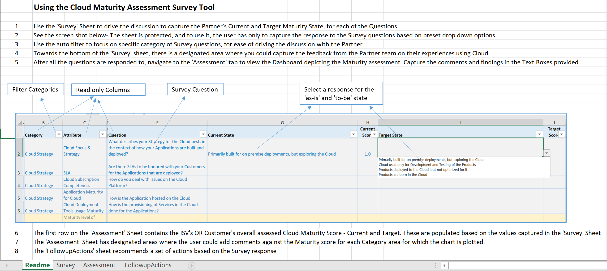
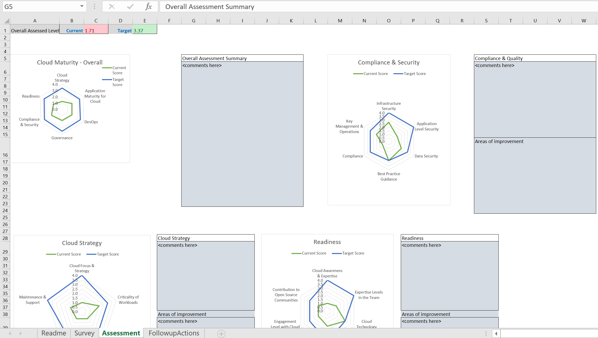
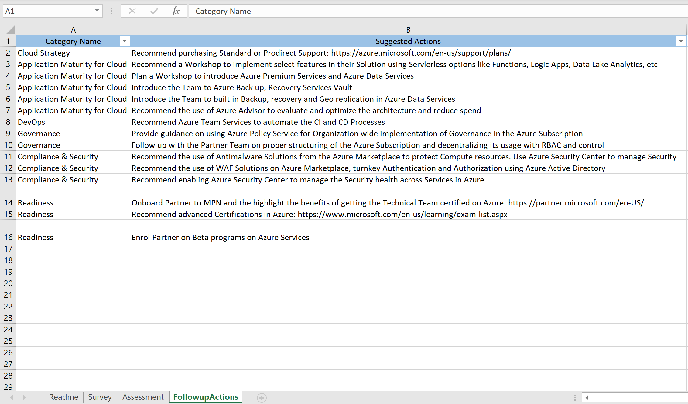

# Cloud Maturity Assessment Survey Tool

An Office Excel based tool that can used by 
  - Organizations adopting a Cloud Platform, or 
  - by ISV Vendors that provide Cloud based Solutions to their Customers
  
to assess how they are utilising the Cloud Platform today and the state that they aspire to be in, in the future.

## How to use the Tool
Download the tool from this Repo. 
The Excel file has a 'Readme' sheet that explains how it needs to be used. See the image below

Respond to the Survey questions by selecting the options that represents the 'current' state and a Target 'To-be' State 

* :boom: The Maturity Assessment rating and the Survey questions are not based on any industry Standard or benchmark. It is meant to be used as a self-assessment tool.

## Viewing the 'Assessment' Sheet

Once the Survey is responded to, the 'Assessment' Sheet gets populated with a Spider Chart that graphically represents the current and Target State, across different areas. It gives a bird's eye view of where the gaps are, and identify actions that can lead to filling those gaps. In the 'Comments' section in the sheet, a stakeholder could capture comments and details on the corrective actions required to address the gaps.

## Viewing the 'FollowupActions' Sheet

Based on the Survey response, and the values selected for the 'As-is' and 'To-be' state, certain recommended actions are automatically populated that can help fill the gaps.

